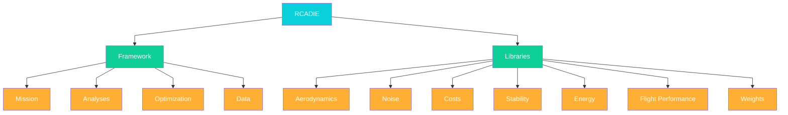

   

 

# 

[RCAIDE: Research Community Aircraft Interdisciplinary Design Environment]([link](https://www.rcaide.leadsresearchgroup.com/))
=======

The Research Community Aircraft Interdisciplinary Design Environment, or RCAIDE  (pronounced “arcade”) is a powerful open-source Python platform that revolutionizes aircraft design and analysis. From commercial airliners to UAVs and next-generation hybrid-electric aircraft, RCAIDE provides comprehensive multi-disciplinary analysis tools backed by validated engineering methods. Our streamlined workflow and modular architecture help aerospace engineers and researchers accelerate development cycles and explore innovative designs with confidence. RCAIDE-LEADS is a form from RCAIDE, developed and maintained by the [Lab for Electric Aircraft Design and Sustainability](https://www.leadsresearchgroup.com/)
 
## Transitioning from SUAVE Legacy 
RCAIDE was built to allow users to transition their work to smoothly from SUAVE to RCAIDE. RCAIDE's code is architected in such a way that a native SUAVE user can understand it but breaks free of some of the antiquated nomenclature. Shown below, the widespread adoption of SUAVE signifies the communities our codebase to provide validated and verified results. Notable users include: 
* **Industry and Government:** NASA, Boeing,  AFRL, Embraer, Joby, Vahana, Argonne National Labs, Bombardier, Raytheon,  BAE, Google,
* **Academia:**  MIT, Purdue, Embry Riddle, Carnegie Mellon,  Princeton, Virginia Tech, Georgia Tech, Michigan Stanford University,  Cranfield University, University of Sydney, TU Delft,  IIT,  University of Toronto, Concordia University, ISAE

   

 

## Code Architecture 
The code is arranged into repositories that house native data structures, functions, components, and subroutines for discipline analyses and support number-crunching operations. This allows developers or avid users seeking to modify the source code to navigate intuitively. Solely written in Python, an RCAIDE installation
appears in one repository that is itself organized into two secondary-level repositories: 
* **RCAIDE** sub-directory, where their source code resides
* **Regressions** sub-directory, where unit tests for verification and validation are performed.

The RCAIDE subdirectory is arranged into frameworks and methods modules. Its predecessor, SUAVE, was written primarily as a superseding framework. Think of framework modules as the glue or roadmap that connects all the functions housed in the Library folder. The framework folder mainly comprises core data structures, classes instances of the various methods within the code, the mission and energy networks and the optimization framework. The Library module comprises five tertiary submodules: Attributes, Components,  Methods, Mission and Plots.

## Capabilities of RCAIDE
RCAIDE currently possesses the ability to perform various analyses at multiple fidelity levels. Higher fidelity provides greater accuracy but requires more computational resources. The multi-fidelity capability enables:

### Aircraft Design & Analysis
* **Geometry**
  * Advanced parameterization
  * 3D visualization
  

     
  

* **Mission Analysis**
  * Complete flight vehicle simulation
  * Energy network analysis
  * Design space exploration

* **Performance Analysis**
  * Payload range studies
  * Aerodynamic characteristics
  * V-N diagrams
  * Propeller performance
  * Takeoff field length estimation

* **Weights & Balance**
  * Operating empty weight estimation
  * Component-level weight breakdown
  * Center of gravity analysis
  * Moment of inertia calculations
  

     
  

### Advanced Capabilities
* **Optimization**
  * Gradient-based methods
  * Non-gradient algorithms
  * Multi-fidelity approaches
* **Artificial Intelligence Integration**
* **Model-Based Systems Engineering**

## External Interfaces
RCAIDE currently supports two external packages, OpenVSP and AVL. Regarding the former, users can automatically generate OpenVSP geometry from RCAIDE and even read in geometry to perform mission simulations. RCAIDE’s AVL interface enables the automatic generation of AVL files in addition to running AVL directly through the built-in Python API. This allows the designers to focus on design and analysis. Currently, the development team is working on an API for SU2, a high-fidelity CFD solver. This capability was a feature of SUAVE, and we want to bring it back for new RCAIDE users.

   

 

## Installing RCAIDE 
RCAIDE is available on GNU/Linux, MacOS and Windows. We strongly recommend installing RCAIDE within a Python virtual environment to avoid altering any distribution of Python files. Please review the documentation for instructions on creating a virtual environment for RCAIDE.

* [See Installation Instructions](https://www.docs.rcaide.leadsresearchgroup.com/install.html)
* Using pip : `pip install RCAIDE-LEADS`
* Using conda (coming soon) 

## Tutorials
[See Tutorials here](https://docs.rcaide.leadsresearchgroup.com/tutorials.html)

## Citing RCAIDE
(coming soon) 

## Contributing to RCAIDE
**Contributing Institutions** 
* Aerospace Research Community, LLC
* [University of Illinois Lab for Electric Aircraft Design and Sustainability](https://www.leadsresearchgroup.com/)
* [Stanford University Aerospace Design Lab](http://adl.stanford.edu)
  
**Contributing Developers**  
* Matthew Clarke 
* Emilio Botero 
* Jordan Smart 
* Racheal Erhard
* [University of Illinois Lab for Electric Aircraft Design and Sustainability](https://www.leadsresearchgroup.com/)) 
* [Stanford University Aerospace Design Lab](http://adl.stanford.edu)

**Getting Involved**   

If you'd like to help us develop RCAIDE by adding new methods, writing documentation, or fixing embarrassing bugs, please look at these [guidelines](https://www.docs.rcaide.leadsresearchgroup.com/contributing.html) first.

Submit improvements or new features with a [pull request](https://github.com/leadsgroup/RCAIDE_LEADS/pulls)

## Get in touch

Share feedback, report issues, and request features via or [Github Issues](https://github.com/leadsgroup/RCAIDE_LEADS/issues)

Engage with peers and maintainers in [Discussions](https://github.com/leadsgroup/RCAIDE_LEADS/discussions)

