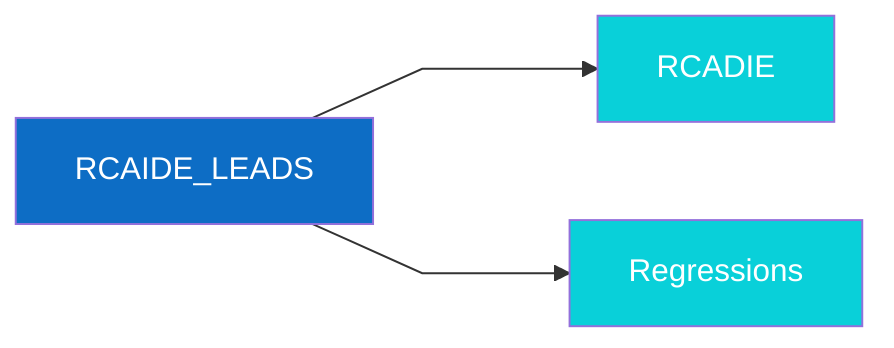

```mermaid
%%{init: {'flowchart': {'curve': 'linear', 'nodeSpacing': 50, 'rankSpacing': 50}}}%%
flowchart LR
    RCAIDE_LEADS[RCAIDE_LEADS]
    RCADIE[RCADIE]
    Regressions[Regressions]
    
    RCAIDE_LEADS ---> RCADIE
    RCAIDE_LEADS ---> Regressions

    style RCAIDE_LEADS fill:#0d6dc5,color:#fff
    style RCADIE fill:#09d0d9,color:#fff
    style Regressions fill:#09d0d9,color:#fff
```
